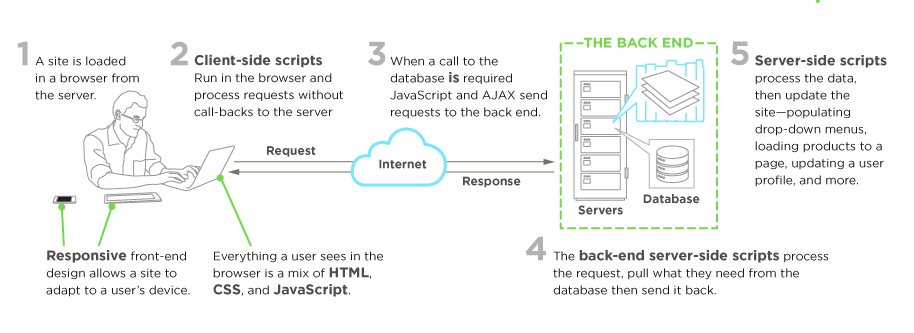

Este capítulo proporciona una explicación básica para el desarrollo de front-end y la disciplina de desarrollador de front-end.

> El desarrollo web front-end, también conocido como desarrollo del lado del cliente, es la práctica de producir HTML, CSS y JavaScript para un sitio web o aplicación web, de modo que un usuario pueda verlos e interactuar con ellos directamente.   
El desafío asociado con el desarrollo de front-end es que las herramientas y técnicas utilizadas para crear el front-end de un sitio web cambian constantemente, por lo que el desarrollador debe estar constantemente al tanto de cómo se está desarrollando el campo.   
El objetivo de diseñar un sitio es garantizar que cuando los usuarios abren el sitio vean la información en un formato que sea fácil de leer y relevante. Esto se complica aún más por el hecho de que los usuarios ahora usan una gran variedad de dispositivos con diferentes tamaños de pantalla y resoluciones, lo que obliga al diseñador a tener en cuenta estos aspectos al diseñar el sitio. Deben asegurarse de que su sitio aparezca correctamente en diferentes navegadores (cross-browser), diferentes sistemas operativos (plataforma) y diferentes dispositivos (multidispositivo), lo que requiere una planificación cuidadosa por parte del desarrollador.   
<https://en.wikipedia.org/wiki/Front-end_web_development>

Fuente de la imagen: https://www.upwork.com/hiring/development/front-end-developer/

## Un desarrollador front-end ...

Un desarrollador front-end diseña y desarrolla sitios web y aplicaciones web utilizando tecnologías web (es decir, [HTML](https://developer.mozilla.org/en-US/docs/Web/HTML), [CSS](https://developer.mozilla.org/en-US/docs/Web/CSS) y [JavaScript](https://developer.mozilla.org/en-US/docs/Web/JavaScript)), que normalmente se ejecuta en la plataforma web abierta o actúa como entrada de compilación para entornos de plataforma que no son web (es decir, [React Native](https://facebook.github.io/react-native/)).

Una persona se introduce en el mundo del desarrollo front-end aprendiendo a construir un sitio web o una aplicación web que se basa en HTML, CSS y JavaScript y que comúnmente se ejecuta en un navegador web, pero también puede ejecutarse en un navegador sin cabeza, [WebView](http://developer.telerik.com/featured/what-is-a-webview/) o como compilación. Estos cuatro escenarios de tiempos de ejecución se explican a continuación.

## Navegadores web (los más comunes)

Un navegador web es un software que se utiliza para recuperar, presentar y recorrer información en la WWW. Por lo general, los navegadores se ejecutan en una computadora de escritorio o portátil, tableta o teléfono, pero últimamente se puede encontrar un navegador en casi cualquier cosa (es decir, en un refrigerador, en automóviles, etc.).

Los navegadores web más comunes son (se muestran primero [en orden de los más utilizados](https://en.wikipedia.org/wiki/Usage_share_of_web_browsers#Summary_tables)):

- [Chrome](http://www.google.com/chrome/)
- [Safari](http://www.apple.com/safari/)
- [Internet Explorer](https://en.wikipedia.org/wiki/Internet_Explorer) (Nota: no Edge, refiriéndose a IE 9 a IE 11)
- [Firefox](https://www.mozilla.org/firefox/)
- [Edge](https://www.microsoft.com/en-us/windows/microsoft-edge)

## Navegadores sin cabeza

Los navegadores sin cabeza son navegadores web sin una interfaz gráfica de usuario que se puede controlar desde una interfaz de línea de comandos mediante programación con el fin de automatizar la página web (por ejemplo, pruebas funcionales, raspado, pruebas unitarias, etc.). Pensar en navegadores sin cabeza como un navegador que puede ejecutar mediante programación desde la línea de comandos que puede recuperar y recorrer el código de la página web.

Los navegadores sin cabeza más comunes son:

- [Chromium sin cabeza](https://chromium.googlesource.com/chromium/src/+/lkgr/headless/README.md)
- [Zombi](https://github.com/assaf/zombie)
- [slimerjs](http://slimerjs.org/)
- [puppeteer](https://github.com/GoogleChrome/puppeteer)

## Vistas web

Las vistas web son utilizadas por un sistema operativo nativo, en una aplicación nativa, para ejecutar páginas web. Piense en una vista web como un iframe o una sola pestaña de un navegador web que está incrustado en una aplicación nativa que se ejecuta en un dispositivo (por ejemplo, iOS, Android, Windows).

Las soluciones más comunes para el desarrollo de vistas web son:

- [Cordova](https://cordova.apache.org/) (normalmente para aplicaciones nativas de teléfono/tablet)
- [NW.js](https://github.com/nwjs/nw.js) (normalmente utilizado para aplicaciones de escritorio)
- [Electron](http://electron.atom.io/) (normalmente utilizado para aplicaciones de escritorio)

## Nativo de Web Tech

Eventualmente, lo que se aprende del desarrollo del navegador web puede ser utilizado por los desarrolladores front-end para crear código para entornos que no son impulsados ​​por un motor de navegador (es decir, una plataforma web). Últimamente, se están ideando entornos de desarrollo que utilizan tecnologías web (por ejemplo, CSS y JavaScript), sin motores web, para crear aplicaciones nativas.

Algunos ejemplos de estos entornos son:

- [Flutter](https://flutter.io/)
- [React Native](https://facebook.github.io/react-native/)
- [NativeScript](https://www.nativescript.org/)

> Notas:   
\ 1. Asegúrese de tener claro qué se entiende exactamente por "plataforma web". Lea la página de Wikipedia "[Plataforma web abierta](https://en.wikipedia.org/wiki/Open_Web_Platform)". Explore las [muchas tecnologías](https://platform.html5.org/) que componen la plataforma web.
