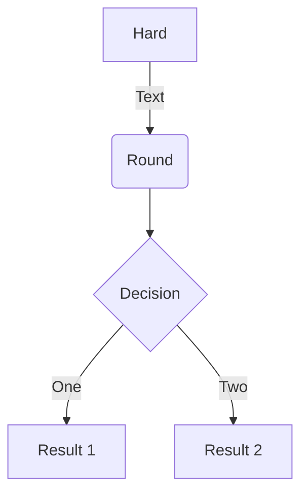
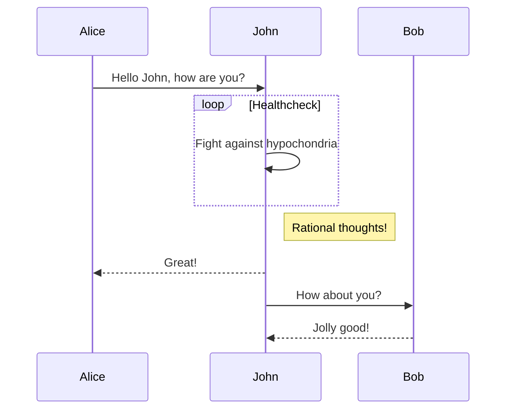
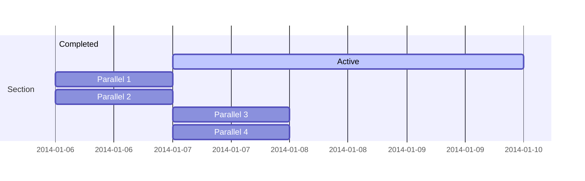
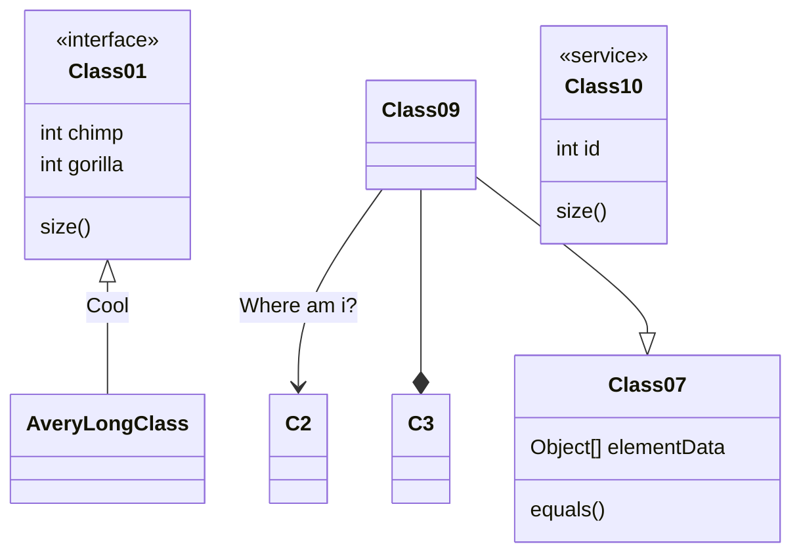
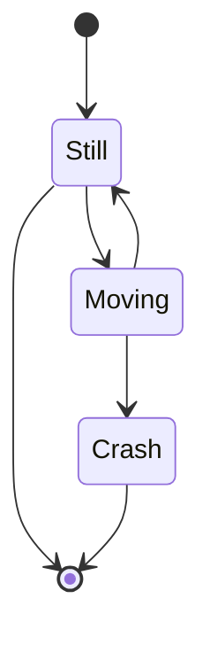

Academic está diseñado para brindar a los creadores de contenido técnico una experiencia perfecta. Puede centrarse en el contenido y Academic se encarga del resto.

**Resalte los fragmentos de código, tome notas sobre las clases de matemáticas y dibuje diagramas de la representación textual.**

En esta página, encontrará algunos ejemplos de los tipos de contenido técnico que se pueden representar con Academic.

## Ejemplos

### Código

Academic admite una extensión Markdown para resaltar la sintaxis del código. Puede habilitar esta función alternando la opción `highlight` en su archivo `config/_default/params.toml`.

    ```python
    import pandas as pd
    data = pd.read_csv("data.csv")
    data.head()
    ```

se ve como

```python
import pandas as pd
data = pd.read_csv("data.csv")
data.head()
```

### Math

Academic admite una extensión Markdown para $\LaTeX$ math. Puede habilitar esta función alternando la opción `math` en su archivo `config/_default/params.toml`.

Para representar las matemáticas *inline* o *block*, envuelva sus maths LaTeX con `$ ... $` o `$$ ... $$`, respectivamente.

Ejemplo **bloque matemático**:

```tex
$$\gamma_{n} = \frac{
\left | \left (\mathbf x_{n} - \mathbf x_{n-1} \right )^T
\left [\nabla F (\mathbf x_{n}) - \nabla F (\mathbf x_{n-1}) \right ] \right |}
{\left \|\nabla F(\mathbf{x}_{n}) - \nabla F(\mathbf{x}_{n-1}) \right \|^2}$$
```

se ve como

$$\gamma_{n} = \frac{ \left | \left (\mathbf x_{n} - \mathbf x_{n-1} \right )^T \left [\nabla F (\mathbf x_{n}) - \nabla F (\mathbf x_{n-1}) \right ] \right |}{\left \|\nabla F(\mathbf{x}_{n}) - \nabla F(\mathbf{x}_{n-1}) \right \|^2}$$

Ejemplo **inline math** `$\nabla F(\mathbf{x}_{n})$` se ve como $\nabla F(\mathbf{x}_{n})$.

Ejemplo **multi-line math** usando la `\\` salto de línea de math:

```tex
$$f(k;p_0^*) = \begin{cases} p_0^* & \text{if }k=1, \\
1-p_0^* & \text {if }k=0.\end{cases}$$
```

se ve como

$$f(k;p_0^*) = \begin{cases} p_0^* & \text{if }k=1, \\
1-p_0^* & \text {if }k=0.\end{cases}$$

### Diagramas

Academic admite una extensión Markdown para diagramas. Puede habilitar esta función alternando la opción `diagram` en su archivo `config/_default/params.toml` o agregando `diagram: true` a la front matter de su página.

Un ejemplo **diagrama de flujo**:

    ```mermaid
    graph TD
    A[Hard] -->|Text| B(Round)
    B --> C{Decision}
    C -->|One| D[Result 1]
    C -->|Two| E[Result 2]
    ```

se ve como



Un ejemplo de **diagrama de secuencia**:

    ```mermaid
    sequenceDiagram
    Alice->>John: Hello John, how are you?
    loop Healthcheck
        John->>John: Fight against hypochondria
    end
    Note right of John: Rational thoughts!
    John-->>Alice: Great!
    John->>Bob: How about you?
    Bob-->>John: Jolly good!
    ```

se ve como



Un ejemplo de **diagrama de Gantt**:

    ```mermaid
    gantt
    section Section
    Completed :done,    des1, 2014-01-06,2014-01-08
    Active        :active,  des2, 2014-01-07, 3d
    Parallel 1   :         des3, after des1, 1d
    Parallel 2   :         des4, after des1, 1d
    Parallel 3   :         des5, after des3, 1d
    Parallel 4   :         des6, after des4, 1d
    ```

se ve como



Un ejemplo de **diagrama de clase**:

    ```mermaid
    classDiagram
    Class01 <|-- AveryLongClass : Cool
    <<interface>> Class01
    Class09 --> C2 : Where am i?
    Class09 --* C3
    Class09 --|> Class07
    Class07 : equals()
    Class07 : Object[] elementData
    Class01 : size()
    Class01 : int chimp
    Class01 : int gorilla
    class Class10 {
      <<service>>
      int id
      size()
    }
    ```

se ve como



Un ejemplo de **diagrama de estado**:

    ```mermaid
    stateDiagram
    [*] --> Still
    Still --> [*]
    Still --> Moving
    Moving --> Still
    Moving --> Crash
    Crash --> [*]
    ```

se ve como



### Listas "Para hacer"

Puede incluso escribir sus listas "Para hacer":

```markdown
- [x] Write math example
- [x] Write diagram example
- [ ] Do something else
```

se ve como

- [x] Write math example
- [x] Write diagram example
- [ ] Do something else

### Tablas

Representar sus datos en tablas:

```markdown
| First Header  | Second Header |
| ------------- | ------------- |
| Content Cell  | Content Cell  |
| Content Cell  | Content Cell  |
```

se ve como

| First Header  | Second Header |
| ------------- | ------------- |
| Content Cell  | Content Cell  |
| Content Cell  | Content Cell  |

### Al lado

Academic soporta un [shortcode para asides](https://sourcethemes.com/academic/docs/writing-markdown-latex/#alerts), también conocidos como *avisos*, *sugerencias*, o *alertas*. Al ajustar un párrafo en `{} ... {}`, se representará como un aside.

```markdown
{}
A Markdown aside is useful for displaying notices, hints, or definitions to your readers.
{}
```

se ve como

{}
A Markdown aside is useful for displaying notices, hints, or definitions to your readers.
{}

### Did you find this page helpful? Consider sharing it 🙌
